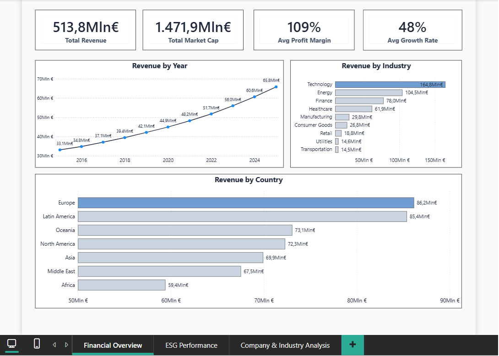
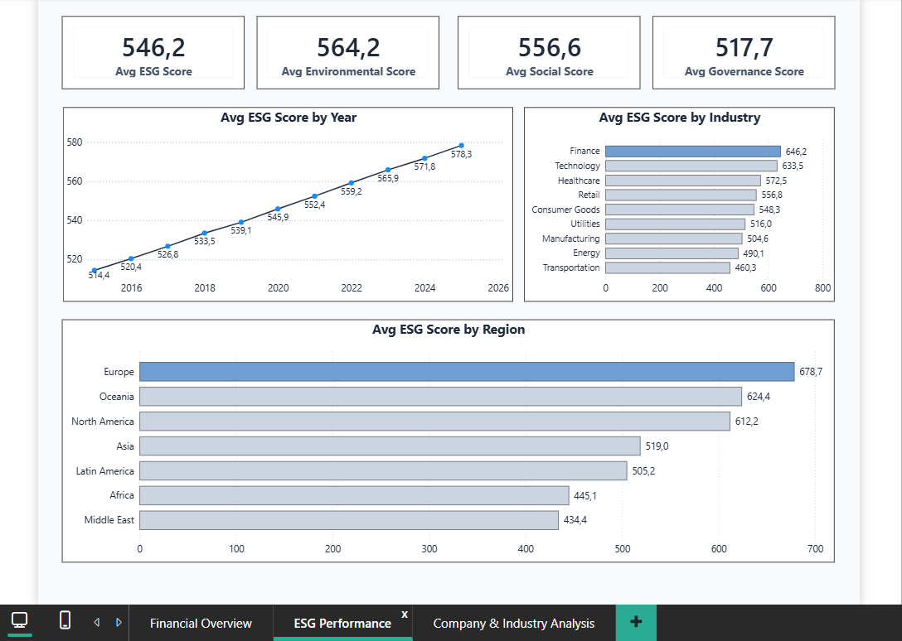
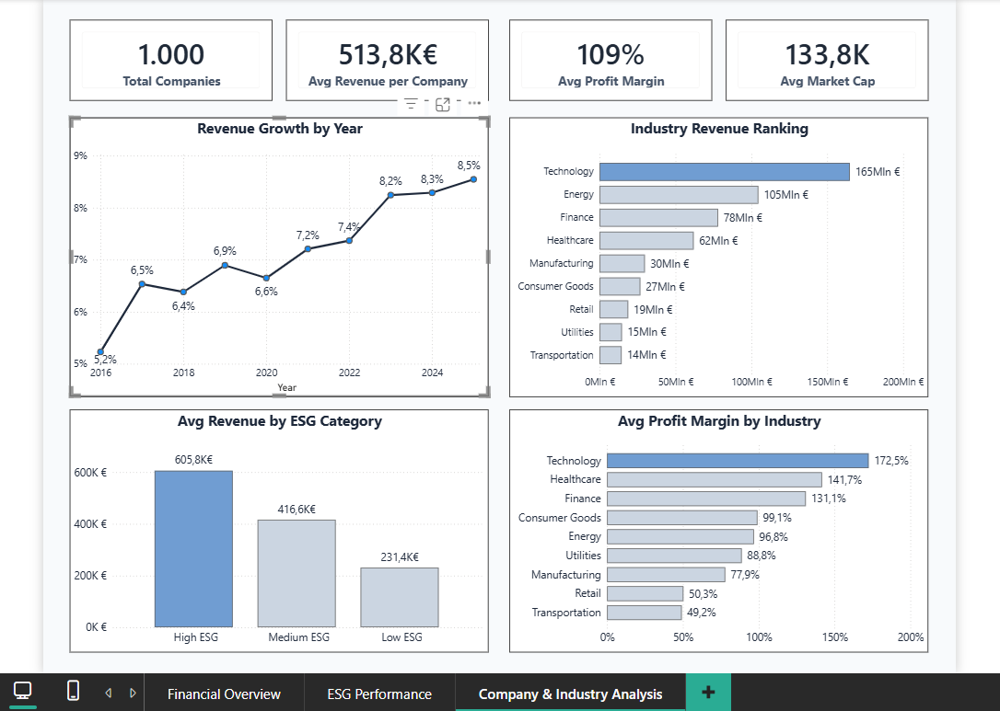

# ESG & Financial Performance Analysis

## Project Overview

This project analyzes ESG and financial performance across companies, industries, regions, and years using the ESG & Financial Performance dataset.

The goal is to understand how financial performance varies across different industries and regions and to explore the relationship between financial results and ESG performance.

The analysis covers key financial indicators such as revenue, market capitalization, profit margin, and growth rate, together with overall ESG, Environmental, Social, and Governance scores.

The project also examines revenue trends over time, industry and country differences, company-level performance, ESG categories, and profitability across industries.

The analysis and interactive dashboards were created using Power BI, with DAX measures used to create KPIs, rankings, and additional analytical metrics.

## Tools Used

- Power BI
- DAX

## Dashboard Structure

### Page 1 - Financial Overview

This page provides an overview of the financial performance of the companies in the dataset.

It presents key indicators such as total revenue, total market capitalization, average profit margin, and average growth rate.

The analysis also examines revenue trends over time and compares total revenue across industries and countries, providing a general view of financial performance across the dataset.

---

### Page 2 - ESG Performance

This page focuses on the ESG performance of the companies.

It presents the average overall ESG score together with the Environmental, Social, and Governance scores.

The analysis examines how ESG performance changes over time and compares average ESG scores across industries and regions, highlighting differences in ESG performance across the dataset.

---

### Page 3 - Company & Industry Analysis

This page provides a more detailed analysis at company and industry level.

It presents key indicators such as total companies, average revenue per company, average profit margin, and average market capitalization.

The analysis examines revenue growth over time, industry revenue rankings, average revenue across ESG categories, and average profit margin by industry.

DAX measures are used to calculate metrics such as average revenue per company, industry revenue rankings, average revenue by ESG category, and average profit margin by industry.

## Key Insights

The analysis highlights a positive trend in both financial and ESG performance between 2015 and 2025. Aggregate revenue nearly doubled, increasing from €33.1M in 2015 to €65.8M in 2025, while the average ESG score steadily increased from 514.4 to 578.3.

Technology emerged as the leading industry in terms of revenue, reaching approximately €165M, followed by Energy and Finance. Europe also recorded the highest aggregate revenue among the regions analyzed.

A clear difference can be seen across ESG categories: companies classified as High ESG (ESG Score ≥ 700) recorded an average revenue of approximately €605.8K, compared with €416.6K for Medium ESG companies (400–699) and €231.4K for Low ESG companies (< 400). This highlights an interesting association between ESG classification and average revenue within the dataset.

## Dashboard Preview

### Page 1 - Financial Overview

### Page 2 - ESG Performance

### Page 3 - Company & Industry Analysis

